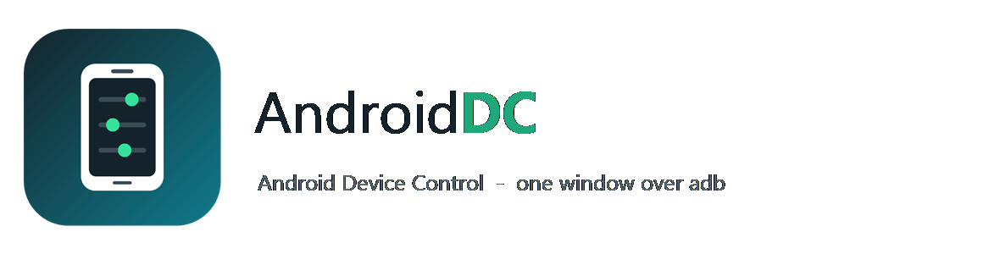

<p align="center">
  
</p>

<p align="center">
  <a href="LICENSE"></a>
  
  
  
</p>

One window on Windows that drives every Android device plugged into it, over plain `adb`.
Mirroring, internet sharing in both directions, files, apps, messages, radios and users —
without leaving the keyboard.

No agent is installed on the phone. Everything goes through the standard Android Debug
Bridge, so the phone only ever does what USB debugging already allows.

## Two windows, one tool

AndroidDC comes with two windows over the same features, and you pick whichever you like:

| Window | Start it with | What it looks like |
|---|---|---|
| **Classic** | `androiddc.vbs` | The original: tabs, dense, every control in view |
| **Nova** | `androiddc-nova.vbs` | A newer design: a side navigation, a device card with battery, signal and screen, cards per task, and an activity log - see [`nova/`](nova/README.md) |

Each window has a button that closes it and opens the other: **Open Nova window** on the
classic *Device* tab, **Classic window** at the bottom of Nova's side navigation. They share
the same adb, scrcpy and gnirehtet, and keep their settings apart.

Both can **start with Windows**, minimized, and both run the same **rules per phone**: plug a
chosen phone in and AndroidDC does what you picked for it - share the phone's internet with the
PC, mirror the screen, turn Wi-Fi off, open an app, and more. Classic: *Advanced > Automation*;
Nova: the *Automation* page.

## What is in it

| Tab | What it does |
|---|---|
| **Device** | Details of the selected phone, live screenshot with click-to-tap, quick toggles (Wi-Fi, Bluetooth, location, rotation, torch, battery saver, haptics, show taps, stay awake, developer options), call / SMS / USSD, and one-click mirroring |
| **Tethering** | PC → phone with [gnirehtet](https://github.com/Genymobile/gnirehtet) (reverse tethering), and phone → PC over USB or a proxy |
| **Advanced** | Five pages: every [scrcpy](https://github.com/Genymobile/scrcpy) option (codec, bit rate, fps, virtual display, OTG, input modes), more of them (recording format and time limit, orientation, window placement, shortcut keys), the adb tools (wireless pairing, mDNS discovery, bug report, private DNS, IME, hotspot), a Root / recovery page that shows what your device cannot do and says why, and Automation (start with Windows, and what each phone does when it is plugged in) |
| **Apps** | What is installed, by name as well as package, launch, force stop, uninstall, open in its own scrcpy window, and install `.apk` or a split `.xapk` / `.apks` / `.apkm` |
| **Contacts / SMS** | Read, add, edit, delete, call, send |
| **Cam / Mic** | Front and rear camera as a video source with zoom, and the phone microphone or output streamed or recorded on the PC, with the codec, encoder and bit rate read from the phone |
| **Files** | Browse, search, sort, rename, upload, download, move, compress, extract, preview pictures and text without saving them, free space of the current volume |
| **Running** | Live process list with memory and state, stop anything |
| **Wi-Fi / Bluetooth / NFC** | Radios on and off, scan, join or forget a network, paired devices |
| **Users** | Multi-user: list, switch, add, remove, turn the user switcher on or off |
| **Shell** | A live adb shell, and a logcat viewer with a level, a filter and save |

Several devices can be connected at once; most actions apply to everything selected in the
device list. Every list also carries its own actions on the right mouse button.

## Getting started

1. Turn on **USB debugging** on the phone and plug it in (or pair it over Wi-Fi).
2. Clone this repository.
3. Run **`get-upstream.ps1`** once. It downloads scrcpy and gnirehtet from their official
   GitHub releases, checks each archive against SHA256 and unpacks it here. The binaries are
   deliberately not committed — they belong to their own projects.
4. Double-click **`androiddc.vbs`** for the classic window, or **`androiddc-nova.vbs`** for Nova.

If a tool turns out to be missing at startup, AndroidDC offers to fetch it for you and waits
until the download is finished before opening.

```powershell
# everything
.\get-upstream.ps1

# only what is not already here
.\get-upstream.ps1 -OnlyMissing

# one package, a specific version, somewhere else
.\get-upstream.ps1 -GetScrcpy -ScrcpyVersion 4.1 -Destination D:\tools\androiddc
```

## Requirements

* Windows 10 or 11, Windows PowerShell 5.1 (ships with Windows) or PowerShell 7
* An Android device with USB debugging enabled
* Nothing else — no Python, no Node, no install

## Files

| File | What it is |
|---|---|
| `androiddc.ps1` | The classic window. One PowerShell script, WinForms user interface |
| `androiddc.vbs` | Starts the classic window without a console — **double-click it** |
| `androiddc-nova.vbs` | Starts the Nova window without a console — **or double-click this one** |
| `nova/` | The Nova window: WPF in PowerShell, one file per page, its theme, fonts and tests |
| `shared/` | What both windows load: starting with Windows and the rules per phone |
| `get-upstream.ps1` | Downloads and verifies scrcpy and gnirehtet |
| `get-upstream.bat` | Double-click wrapper for the above |
| `gnirehtet-share.ps1` | Reverse tethering from the command line, without the window |
| `docs/` | The full documentation |
| `assets/` | Logo, icon and the window icon |
| `INDEX.md` | What every file in the folder is |
| `CHANGELOG.md` | What each release changed |
| `tests/` | Tests that run the real window, with or without a phone |

Settings live in `%APPDATA%\AndroidDC\settings.json` for the classic window and
`nova-settings.json` next to it for Nova, outside the repository. The rules per phone are
`automation.json` in the same folder, read and written by both.

## Known limits

These are Android's rules, not bugs:

* gnirehtet carries TCP and UDP only. **Ping never works through the tunnel** — that is
  ICMP, which it does not forward. Use a real request to test a connection.
* `scrcpy --otg` restarts the adb server, which drops an active reverse tunnel. AndroidDC
  warns first and rebuilds the tunnel afterwards.
* Renaming a user needs `MANAGE_USERS`, a system permission adb does not hold. Adding,
  removing and switching users all work.
* Android exposes no adb command that pairs or connects a Bluetooth device. The radio and
  the paired list are all that can be reached.
* There is no adb command that sends an SMS; the message is composed in the phone's own
  SMS app and sent from there.
* The phone has `tar`, `gzip` and `unzip` but no `zip`, so archives are made as `.tar.gz`.
* `adb root`, `remount`, `sideload` and their neighbours need a userdebug build or recovery.
  They are listed on their own page, marked against your device, rather than hidden.
* A screen capture costs roughly 1.4 s. For anything live, use the scrcpy mirror.

## Contributing

Pull requests are welcome. The classic window is one PowerShell file; Nova has its own rules
in [`nova/CONTRACT.md`](nova/CONTRACT.md). For the classic window:

* keep the layout functions the single place that positions controls — no absolute
  coordinates scattered through event handlers;
* keep adb work off the UI thread (`Invoke-OffThread`, the shared runspace) so the window
  never freezes;
* never hardcode a folder — everything is resolved from `$PSScriptRoot`;
* say what a device actually reports. If Android refuses something, the log should say so
  rather than pretend it worked.

## Documentation

Full documentation lives in [`docs/`](docs/):

| Page | What is in it |
|---|---|
| [Getting started](docs/getting-started.md) | Install, first run, connecting a phone over USB or Wi-Fi |
| [User guide](docs/user-guide.md) | Every tab and every button, one by one |
| [Shortcuts](docs/shortcuts.md) | Keyboard and mouse, including the screen pane |
| [Command line](docs/command-line.md) | `get-upstream.ps1` and `gnirehtet-share.ps1` reference |
| [What it runs on your phone](docs/what-it-runs.md) | Every adb command the program can issue, and why |
| [Limits](docs/limits.md) | What Android does not allow, and what that means here |
| [Troubleshooting](docs/troubleshooting.md) | Symptoms, causes, fixes |
| [Architecture](docs/architecture.md) | How the script is put together, for contributors |

## License

Apache License 2.0 — see [LICENSE](LICENSE).

scrcpy and gnirehtet are separate projects by [Genymobile](https://github.com/Genymobile),
also Apache-2.0. AndroidDC downloads their official releases; it does not redistribute them.

Nova's typefaces, DM Sans and Space Grotesk in `nova/fonts/`, are from Google Fonts under the
SIL Open Font License 1.1; their license files are next to them.
